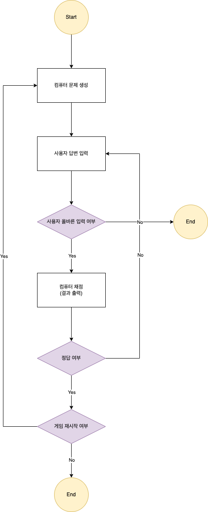

# 숫자 야구 게임
## 진행 방법
* 숫자 야구 게임 요구사항을 파악한다.
* 요구사항에 대한 구현을 완료한 후 자신의 github 아이디에 해당하는 브랜치에 Pull Request(이하 PR)를 통해 과제를 제출한다.

## 과제 제출 과정
* [과제 제출 방법](https://github.com/next-step/nextstep-docs/tree/master/precourse)

## 기능 목록
* 컴퓨터(Computer)
  * 문제 생성
  * 채점 및 결과 출력
  * 정답 확인
* 사용자(User)
  * 답변 입력
    * 올바른 답변 입력 확인
* 야구 게임(BaseballGame)
  * 게임 시작
  * 게임 진행
  * 게임 종료
  * 게임 재시작

